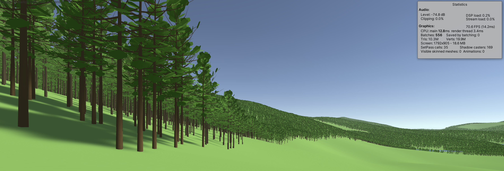
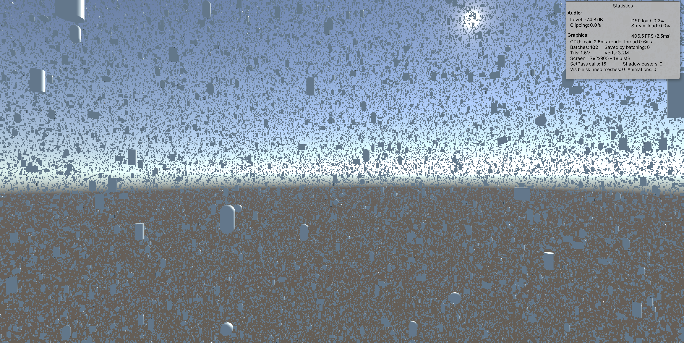

# Custom static billboards

This project includes custom billboarding solution for rendering large number of objects. Billboarding works in a similar way like camera facing tree billboards. Here is summary of pros and cons:

Pros:
- Capable of rendering hundreds of thousands to millions of static objects such as trees at playable framerates.
- Billboard baking happening on runtime, no need to bake in editor, just like with Unity trees.
- Fully C#, no obfuscated dll's, no native code.
- Includes custom code for static batching of billboards at runtime.
- Accelerated by DOTS Job System and Burst compiler.
- Does not use instancing so can run on older machines which does not support instancing.
- Bottlenecks smoothed through asynchronous scheduler which distributes batching over multiple frames.
- Setup on both build-in and URP render pipelines.
- Billboards aligning to perspective camera.
- Can update during different time of day even if camera is not rotated by player.
- Ability to set billboard start distance per object type, i.e. useful for smaller objects such as bushes to set smaller start distances, while for large objects such as trees, larger start distances.

Cons:
- No culling, all billboards will be rendered, including these which are behind the camera.
- Passing native arrays into Mesh API is currently the main bottleneck and is distibuted over multiple frames, so if there are millions of objects, full refresh can take about a second. Objects will update in the background without blocking the main thread.
- Some performance spikes can still occur while moving camera when there are large number of objects.
- Slightly worse performance compared to build in Unity tree billboards.
- Similarly like for Unity tree bilboards, only one rotation is supported per billboard type.
- Billboards can cast shadows but they appear paper thin when camera looks in near perpendicular direction to the directional light.
- While different shaders work, it can be tricky to set mathing lighting between model and billboard phases over different times of day. Currently the best working shaders seems to be unlit shaders for billboards.
